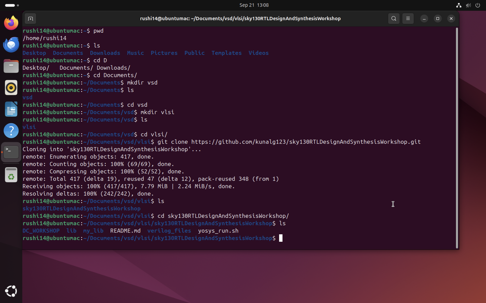
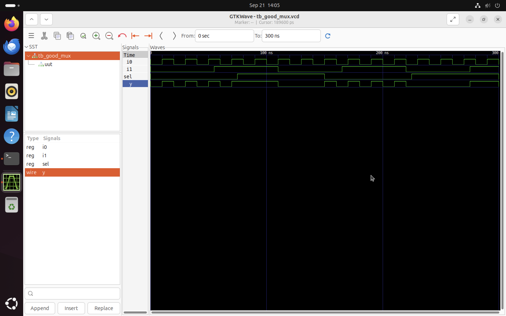
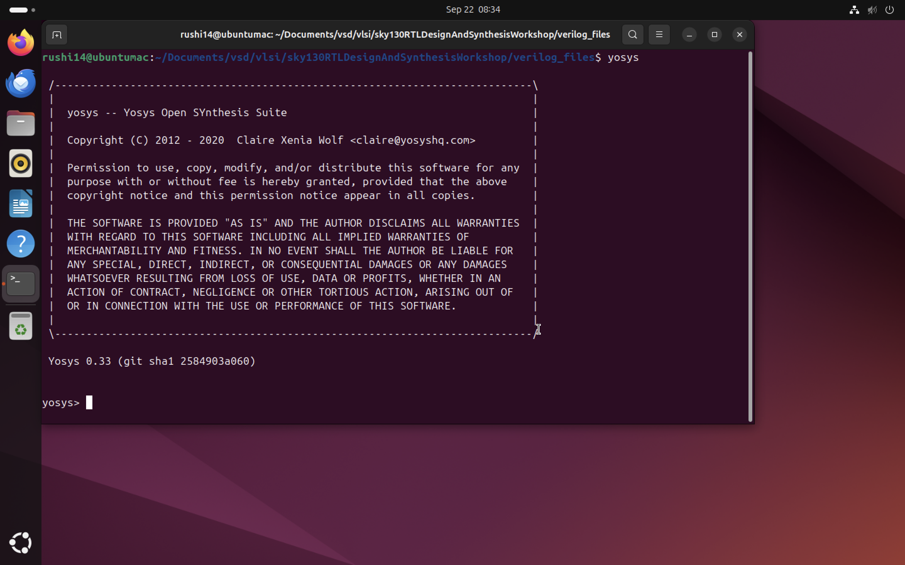
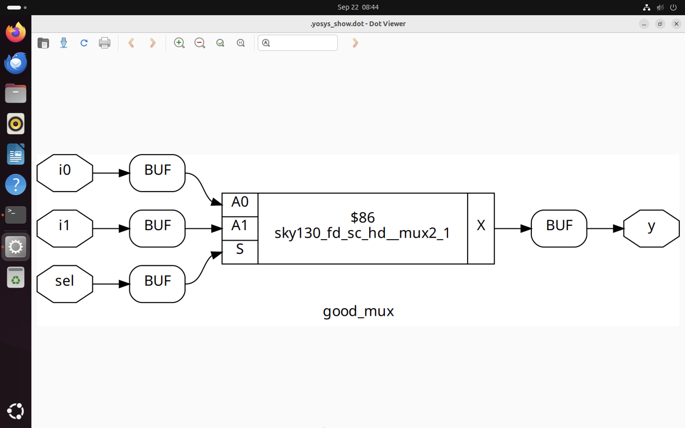

# Introduction to Iverilog, Testbenches, DUT, and Yosys

This document provides a concise introduction to the key tools and concepts used in the digital logic design flow. Understanding these components and how they relate is essential for taking a design from an idea to a working circuit.

***

### **1. The Tools: Iverilog & Yosys**

* **Icarus Verilog (iverilog):** This is a Simulator which take your verilog code and simulates its behavior and used to verify your logic.

* **Yosys:** This is Synthesis Tool.
It converts verilog code into Gate Level Netlist. This Netlist contain the list of logic gates (AND,OR, Flip Flop) and the connection of it.

***

### **2. The Files: DUT & Testbench**

* **Design Under Test (DUT) File:** The `.v` file is known as DUT file. This file contains the actual circuit which you are designing and want to test. ex : ```  good_mux.v```

* **Testbench File:** A separate `.v` file which generaly mention `tb` in name is used for testing the DUT file. ex: ```tb_good_mux.v```
***


## 3. Simulation of 2:1 Multiplexer
* **Clone the Repository for Workshop** 
 
    ``` bash
    git clone https://github.com/kunalg123/sky130RTLDesignAndSynthesisWorkshop.git
    ```
    
    * Navigate to verilog_files folder
     ```bash
     cd sky130RTLDesignAndSynthesisWorkshop/verilog_files
    ```
* **Installation required**
    ```bash
    sudo apt install iverilog  //iverilog Simulator

    sudo apt install gtkwave   //gtkwave for analyse waveform
    ```
* **Design simulation**
    * We are using ```good_mux.v``` DUT file for sumulation.
    * ```tb_good_mux.v``` is the testbench file.

    * To compile Design and Testbench use
    ```bash
    iverilog good_mux.v tb_good_mux.v
    ```
    * To run simulation use
    ```bash
    ./a.out
    ```
    
    * The ```.vcd``` file will be generated. 
    

    * Open gtkwave to view waveform use
    ```bash
    gtkwave tb_good_mux.vcd
    ```
    

## Yosys Synthesis Steps

* **Step1 - Open Yosys**
    ```bash
    yosys
    ```

    
* **Step2 - Load standerd cell library**
    ```bash
    read_liberty -lib ../lib/sky130_fd_sc_hd__tt_025C_1v80.lib  //use path to locate sky130_fd_sc_hd__tt_025C_1v80.lib file
    ```
* **Step3 - Read verilog design**
    ```bash
    read_verilog good_mux.v //Loads your HDL design 
    ```
* **Step4 - Define the top Module**
    ```bash
    synth -top good_mux  //Synthesize your RTL into generic gate
    ```
* **Step5 - Technplogy mapping with abc**
    ```bash
    abc -liberty ../lib/sky130_fd_sc_hd__tt_025C_1v80.lib 
    ```
* **Step6 - Write out Gate-Level Netlist**
    ```bash
    write_verilog good_mux_netlist.v 
    ```
* **Step7 - View the Schematic**
    ```bash
    show 
    ```

    


