## Introduction to Optimizations of Combinational and Sequential Logic

Today we are working on Optimization of Combinational and Sequential logic circuits and introducing techniques to enhance efficiency and performance.


In this we have done lots of labs from which we learn optimization.

---

## Introduction to Optimizations


### I. **Constant Propagation**

It is a compiler optimization where variables with fixed values are directly replaced by constants during synthesis.

Tool checks design code and finds constant values and replaces variables with those constants

**Advantages:**
* Reduced Complexity: Smaller, simpler logic.
* Better Performance: Faster and less delay.
* Resource Saving: Uses fewer gates/flip-flops.

### II. **State Optimization**

It improves efficiency of finite state machines by reducing states, optimizing encoding, and minimizing logic.

**Advantages**
* To reduce hardware complexity (fewer flip-flops & gates).
* To lower power consumption (less switching activity).
* To improve speed (shorter critical paths).
* To optimize silicon area in IC design.

### III. **Cloning**
Cloning involves duplicating a logic cell or gate so that the load on a single cell is reduced, thereby improving performance and reducing delay.

**Advantages**
* Reduces propagation delay.
* Balances load distribution.
* Improves circuit speed.
* Helps meet timing requirements in physical design.

### IV. **Retiming**

Retiming is a circuit optimization technique where the positions of flip-flops are moved across combinational logic without changing the overall input-output behavior.

**Advantages**
* Higher maximum clock speed.
* Balanced pipeline stages.
* Reduced power (less glitching).
* Better timing closure during synthesis & PnR.

---

## **Lab_1 (Combinational Logic)**

In this lab we are using ```opt_check.v``` file as DUT and ```tb_opt_check.v``` as testbench.

**1] Yosys Synthesis**

* ```bash
    yosys
    ```

*  ```bash
     read_liberty -lib ../lib/sky130_fd_sc_hd__tt_025C_1v80.lib  
    ```
* ```bash
    read_verilog opt_check.v      //Loads your HDL design 
    ```
* ```bash
    synth -top opt_check  //Synthesize your RTL into generic gate
    ```

* ```bash
    opt_clean -purge
    ```

*  ```bash
     abc -liberty ../lib/sky130_fd_sc_hd__tt_025C_1v80.lib 
    ```

* ```bash
    show 
    ```

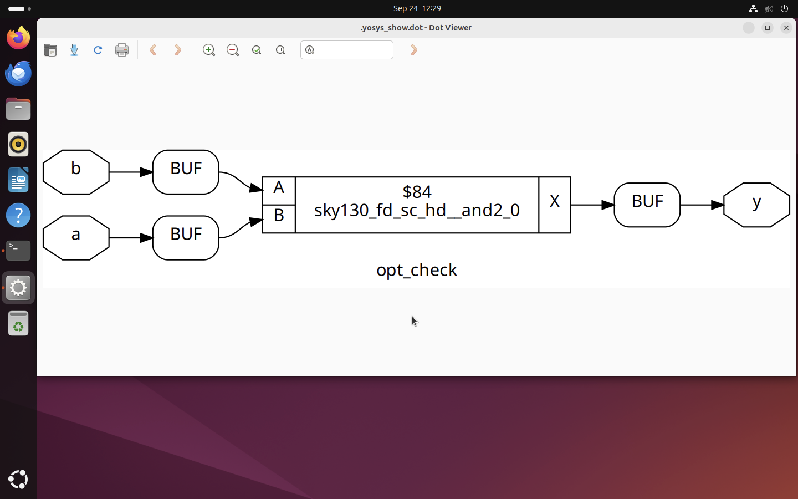

---

Similarly we have to perform steps for ```opt_check2.v``` DUT

We get results as below.

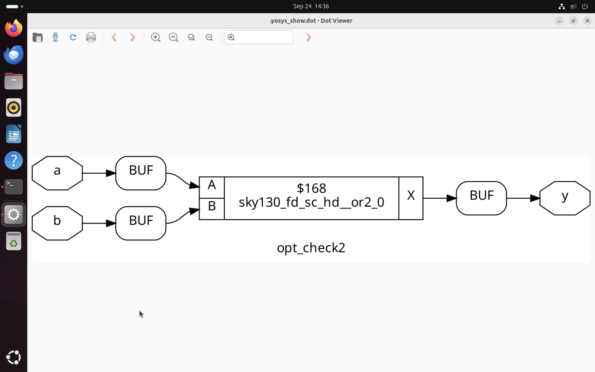

---

Similarly we have to perform steps for ```opt_check3.v``` DUT

We get results as below.

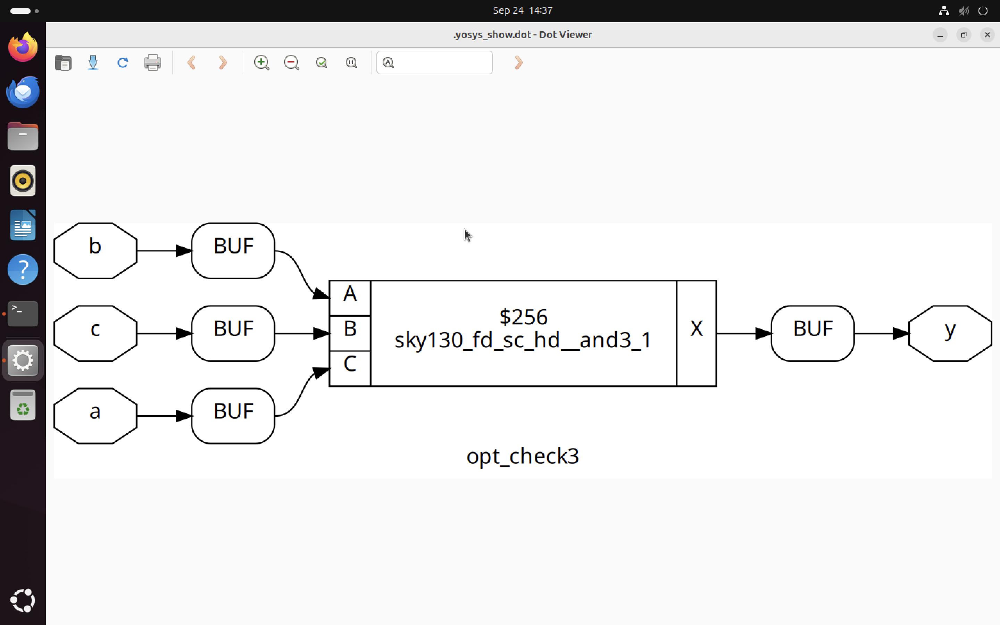

---

### Simulation for ```multiple_module_opt.v``` is little bit different

* We first have to ```flatten``` the module then have to use ```opt_clean -purge```

**1] Yosys Synthesis**

* ```bash
    yosys
    ```

*  ```bash
     read_liberty -lib ../lib/sky130_fd_sc_hd__tt_025C_1v80.lib  
    ```
* ```bash
    read_verilog multiple_module_opt.v      //Loads your HDL design 
    ```
* ```bash
    synth -top multiple_module_opt  //Synthesize your RTL into generic gate
    ```

* ```bash
    flatten 
    ```  

* ```bash
    opt_clean -purge
    ```

*  ```bash
     abc -liberty ../lib/sky130_fd_sc_hd__tt_025C_1v80.lib 
    ```

* ```bash
    show 
    ```
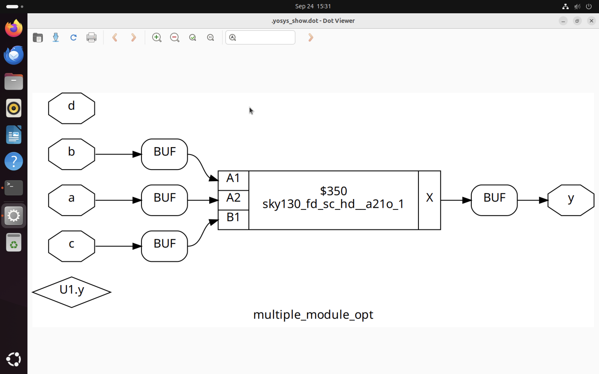

## **Lab_2 (Sequential Logic)**

In this lab we are using ```dff_const1.v``` file as DUT and ```tb_dff_const1.v``` as testbench.


**1] Simulation**
 
* ``` bash
     iverilog dff_const1.v tb_dff_const1.v
  ```

* ```bash
    ./a.out
  ```

* ```bash
    gtkwave tb_dff_const1.vcd
    ```
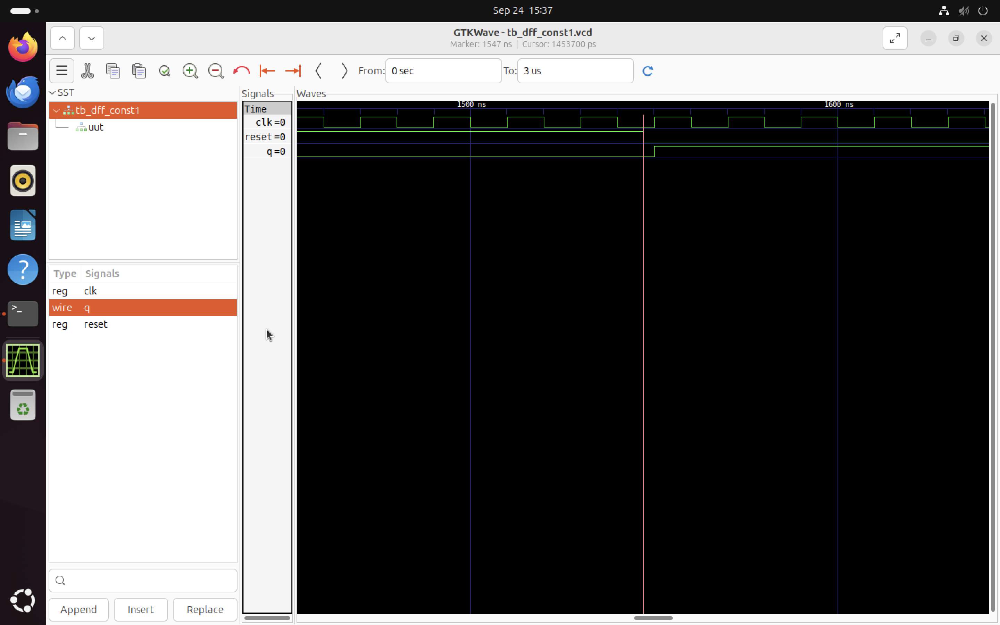

**2] Yosys Synthesis**

* ```bash
    yosys
    ```

*  ```bash
     read_liberty -lib ../lib/sky130_fd_sc_hd__tt_025C_1v80.lib  
    ```
* ```bash
    read_verilog dff_const1.v      //Loads your HDL design 
    ```
* ```bash
    synth -top dff_const1 //Synthesize your RTL into generic gate
    ```

* ```bash
    dfflibmap -liberty ../lib/sky130_fd_sc_hd__tt_025C_1v80.lib 
    ```

*  ```bash
     abc -liberty ../lib/sky130_fd_sc_hd__tt_025C_1v80.lib 
    ```

* ```bash
    show 
    ```

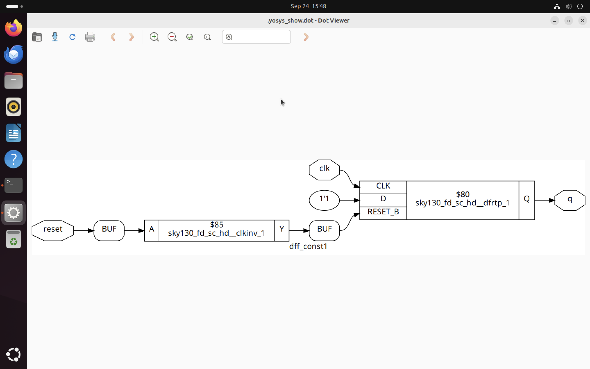

---

Similarly we have to perform steps for ```dff_const2.v``` DUT

We get results as below.

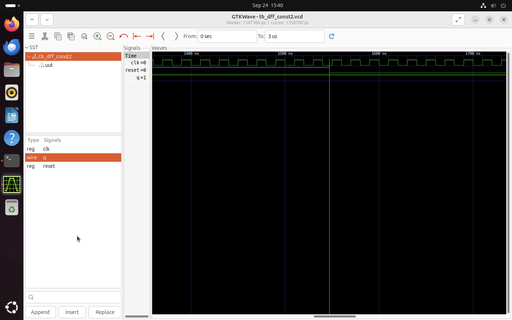
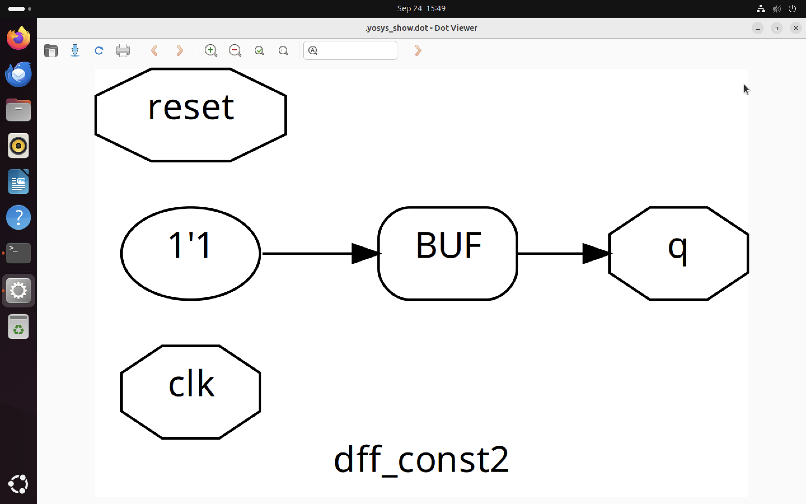

---

Similarly we have to perform steps for ```dff_const3.v``` DUT

We get results as below.


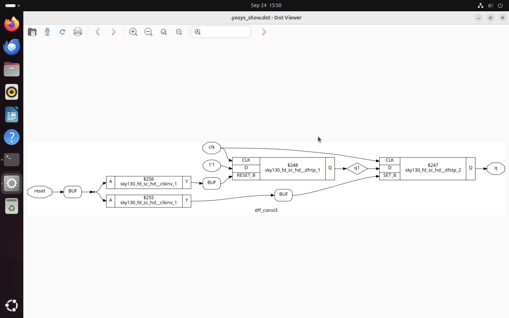

## **Lab_3 (Unused Optimization)**

In this lab we are using ```counter_opt.v``` file as DUT and ```tb_counter_opt.v``` as testbench.

**1] Yosys Synthesis**

* ```bash
    yosys
    ```

*  ```bash
     read_liberty -lib ../lib/sky130_fd_sc_hd__tt_025C_1v80.lib  
    ```
* ```bash
    read_verilog counter_opt.v      //Loads your HDL design 
    ```
* ```bash
    synth -top counter_opt //Synthesize your RTL into generic gate
    ```

* ```bash
    dfflibmap -liberty ../lib/sky130_fd_sc_hd__tt_025C_1v80.lib 
    ```

*  ```bash
     abc -liberty ../lib/sky130_fd_sc_hd__tt_025C_1v80.lib 
    ```

* ```bash
    show 
    ```

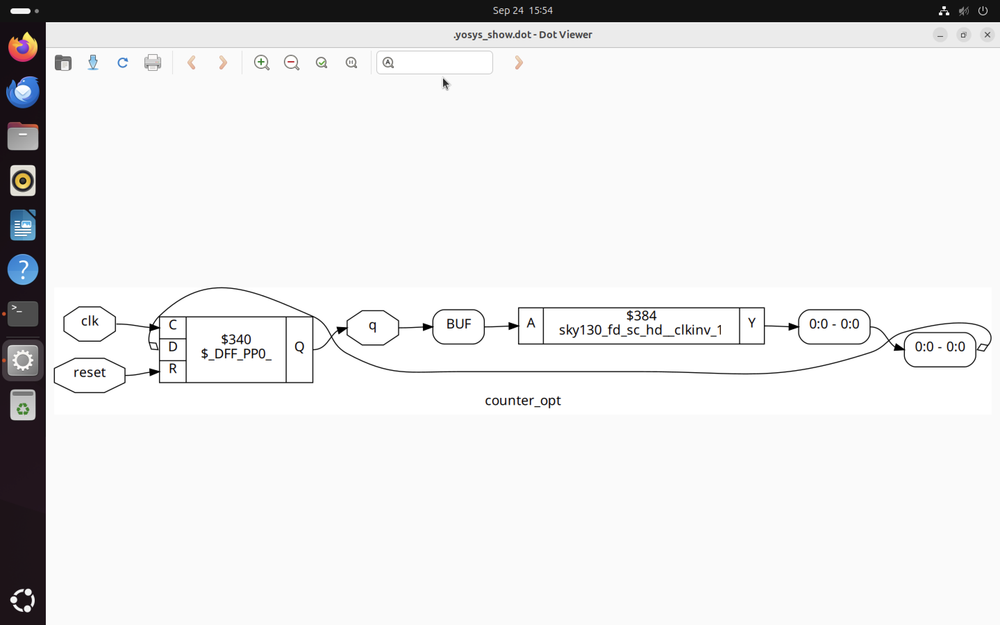

---

Similarly we have to perform steps for ```counter_opt2.v``` DUT

We get results as below.

* use ```synth -top counter_opt``` in synth cmd

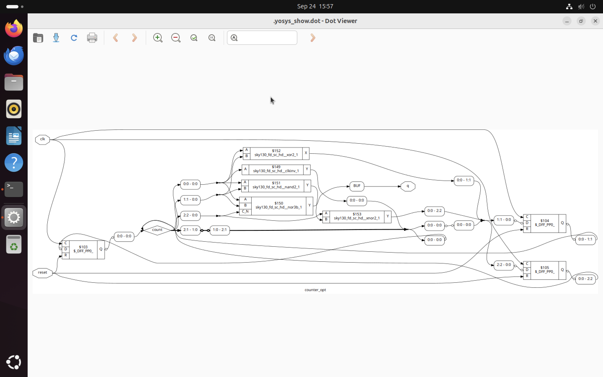
---

With this we successfully completed our labs!!!