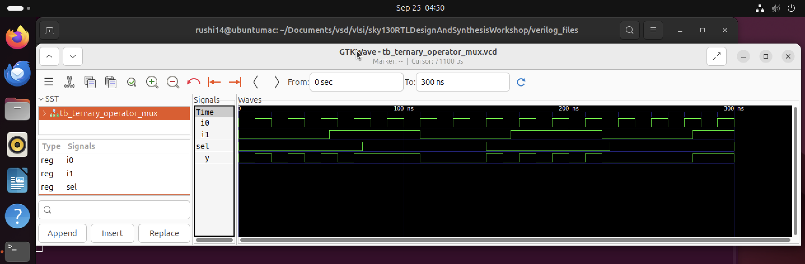
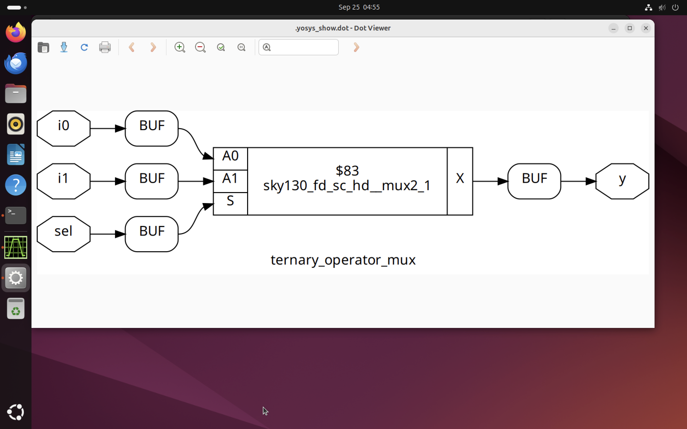
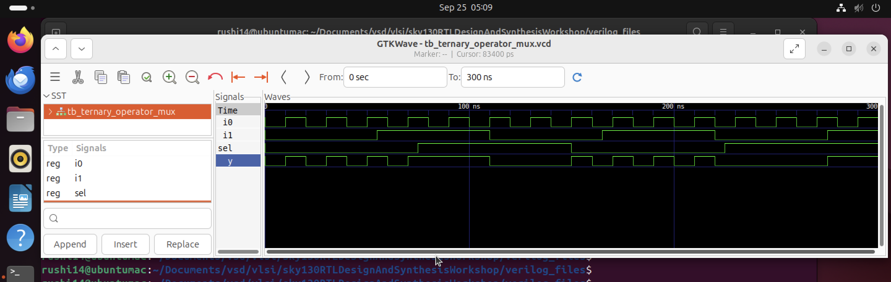
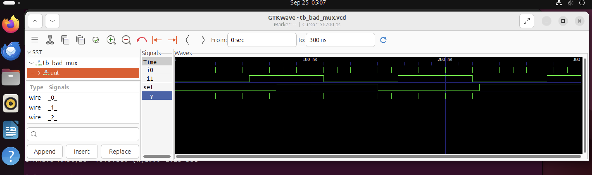
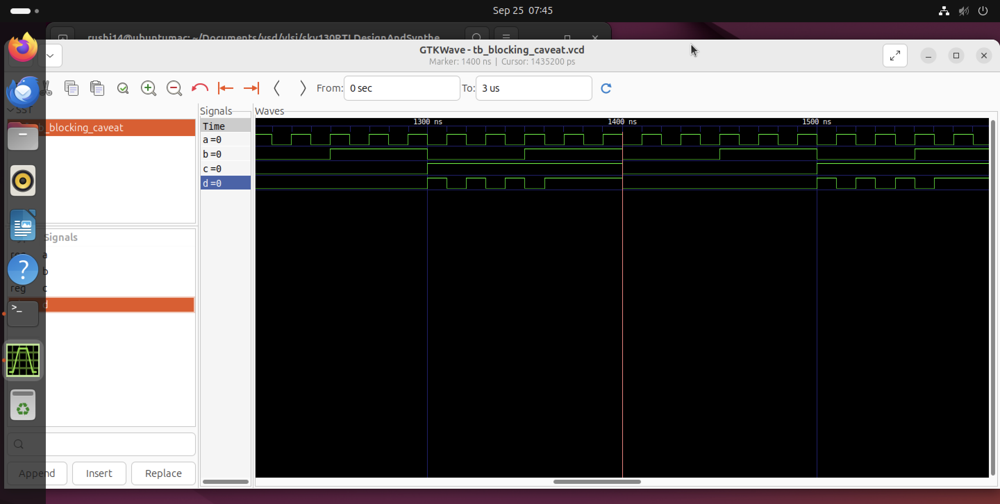
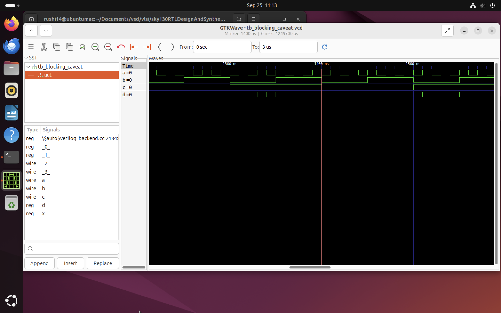

# Introduction to GLS, Blocking vs Non-blocking and Synthesis-Simulation Mismatch

## Why is Gate Level Simulation (GLS) necessary?

* Verify the correctness of the design after synthesis

* Ensure the timing of the design is met which is done with delay annotation (timing aware)

## Synthesis Simulation Mismatches

**It happens because of the following reasons**
* Missing sensitivity list

* Blocking vs non-blocking assignments

* Non-standard verilog coding

**1] Missing sensitivity list**

```always``` block is evaluated only when ``sel`` is changing. So output ``y`` is not evaluated when ``sel`` is not changing although ``i0``and ``i1`` are changing. Rather it acts like a latch. In this case always is evaluated for any signal changes.

**2] Blocking vs Non-blocking Assignments**

Blocking Statements
* Represented by =
* Executes the statements in the order it is written inside always block
* So the first statement is evaluated before the second statement

Non-Blocking Statements
* Represented by <=
* Executes all the RHS when always block is entered and assigns to LHS
* Parallel execution
---


## **Lab_1 (GLS and Synthesis-Simulation Mismatch)**

In this lab we are using ```ternary_operator_mux.v``` file as DUT and ```tb_ternary_operator_mux.v``` as testbench.

**1] Simulation**
 
* ``` bash
     iverilog ternary_operator_mux.v tb_ternary_operator_mux.v
  ```

* ```bash
    ./a.out
  ```

* ```bash
    gtkwave tb_ternary_operator_mux.vcd
    ```


**2] Yosys Synthesis**

* ```bash
    yosys
    ```

*  ```bash
     read_liberty -lib ../lib/sky130_fd_sc_hd__tt_025C_1v80.lib  
    ```
* ```bash
    read_verilog ternary_operator_mux.v      //Loads your HDL design 
    ```
* ```bash
    synth -top ternary_operator_mux //Synthesize your RTL into generic gate
    ```

*  ```bash
     abc -liberty ../lib/sky130_fd_sc_hd__tt_025C_1v80.lib 
    ```

* ```bash
    write_verilog -noattr ternary_operator_mux_net.v 
    ```

* ```bash
    show 
    ```

* ```bash
    exit   //exit yosys
    ```


**3] Gate-Level Simulation (GLS) of MUX**

* ```bash
    iverilog ../my_lib/verilog_model/primitives.v ../my_lib/verilog_model/sky130_fd_sc_hd.v ternary_operator_mux_net.v tb_ternary_operator_mux.v   //find primitives and sky130_fd_sc_hd.v
    ```

* ```bash
    ./a.out
    ```

* ```bash
    gtkwave tb_ternary_operator_mux.vcd
    ```



---

## **Lab_2 (Bad Mux)

In this lab we are using ```bad_mux.v``` file as DUT and ```tb_bad_mux.v``` as testbench.

**Verilog code with issues:**

```bash 
    verilog
    module bad_mux (input i0, input i1, input sel, output reg y);
    always @ (sel) begin
        if (sel)
        y <= i1;
        else 
        y <= i0;
    end
    endmodule
```

The ```always``` block is executed only at ```sel``` signal. It works like a flop rather than mux. The Verilog code of bad_mux.v

**Corrected version:**
```bash
    verilog
    always @ (*) begin
    if (sel)
        y = i1;
    else
        y = i0;
    end
```

After following the above steps, we get the following as result!



---

## **Lab_3 (Synthesis-Simulation Mismatch for Blocking Statements)**

In this lab we are using ```blocking_caveat.v``` file as DUT and ```tb_blocking_caveat.v``` as testbench.

Following the **Simulation** steps:



Following the **Yosys Synthesis** steps and then **Gate-Level Simulation (GLS)** steps:



we can compare the both results.

With this we successfully completed our labs!!!