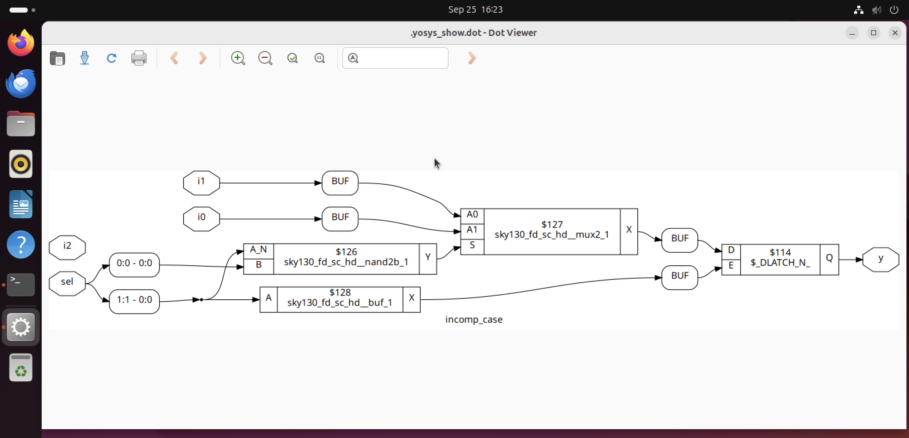

## **Lab_1 (incomplete if)**

In this lab we are using ```incomp_if.v``` file as DUT and ```tb_incomp_if.v``` as testbench.

### Steps for Simulation and Synthesis

**1] Simulation**
 
* ``` bash
     iverilog incomp_if.v tb_incomp_if.v
  ```

* ```bash
    ./a.out
  ```

* ```bash
    gtkwave tb_incomp_if.vcd
    ```


**2] Yosys Synthesis**

* ```bash
    yosys
    ```

*  ```bash
     read_liberty -lib ../lib/sky130_fd_sc_hd__tt_025C_1v80.lib  
    ```
* ```bash
    read_verilog incomp_if.v      //Loads your HDL design 
    ```
* ```bash
    synth -top incomp_if  //Synthesize your RTL into generic gate
    ```

*  ```bash
     abc -liberty ../lib/sky130_fd_sc_hd__tt_025C_1v80.lib 
    ```

* ```bash
    show 
    ```


---
Similarly we have to perform steps for ```incomp_if2.v``` DUT

We get results as below.


---

## **Lab_2 (incomplete overlapping case)**
### Steps for Simulation and Synthesis

**1] Simulation**
 
* ``` bash
     iverilog incomp_case.v tb_incomp_case.v
  ```

* ```bash
    ./a.out
  ```

* ```bash
    gtkwave tb_incomp_case.vcd
    ```


**2] Yosys Synthesis**

* ```bash
    yosys
    ```

*  ```bash
     read_liberty -lib ../lib/sky130_fd_sc_hd__tt_025C_1v80.lib  
    ```
* ```bash
    read_verilog incomp_case.v      //Loads your HDL design 
    ```
* ```bash
    synth -top incomp_case  //Synthesize your RTL into generic gate
    ```

*  ```bash
     abc -liberty ../lib/sky130_fd_sc_hd__tt_025C_1v80.lib 
    ```

* ```bash
    show 
    ```


---
Similarly we have to perform steps for ```comp_case.v``` DUT

We get results as below.


---

Similarly we have to perform Simulation for ```bad_case.v``` DUT

We get results as below.


**3] Steps For GLS**

* ```bash
    yosys
    ```

*  ```bash
     read_liberty -lib ../lib/sky130_fd_sc_hd__tt_025C_1v80.lib  
    ```
* ```bash
    read_verilog bad_case.v      //Loads your HDL design 
    ```
* ```bash
    synth -top bad_case  //Synthesize your RTL into generic gate
    ```

*  ```bash
     abc -liberty ../lib/sky130_fd_sc_hd__tt_025C_1v80.lib 
    ```

* ```bash
    write_verilog -noattr bad_case_net.v
    ```

* ```bash
    exit   //exit yosys
    ```

* ```bash
    iverilog ../my_lib/verilog_model/primitives.v ../my_lib/verilog_model/sky130_fd_sc_hd.v bad_case_net.v tb_bad_case.v   //find primitives and sky130_fd_sc_hd.v
    ```

* ```bash
    ./a.out
    ```

* ```bash
    gtkwave tb_bad_case.vcd
    ```


---

## **Lab_3 (for and for generate)**
**1] Simulation**
 
* ``` bash
     iverilog rca.v tb_rca.v
  ```

* ```bash
    ./a.out
  ```

* ```bash
    gtkwave tb_rca.vcd
    ```


---

Similarly we have to perform **Simulation** for ```demux_case.v``` DUT

We get results as below.


---
Similarly we have to perform **Simulation** for ```derca.v``` DUT

We get results as below.


---

### Simulation for ```rca.v``` is little bit different

**1] Simulation**
 
* ``` bash
     iverilog fa.v rca.v tb_rca.v
  ```

* ```bash
    ./a.out
  ```

* ```bash
    gtkwave tb_rca.vcd
    ```
 


**2] Yosys Synthesis**
* ```bash
    yosys
    ```

*  ```bash
     read_liberty -lib ../lib/sky130_fd_sc_hd__tt_025C_1v80.lib  
    ```
* ```bash
    read_verilog fa.v rca.v     //Loads your HDL design 
    ```
* ```bash
    synth -top rca  //Synthesize your RTL into generic gate
    ```

*  ```bash
     abc -liberty ../lib/sky130_fd_sc_hd__tt_025C_1v80.lib 
    ```

* ```bash
    show 
    ```

---


With this we successfully completed our labs!!!

